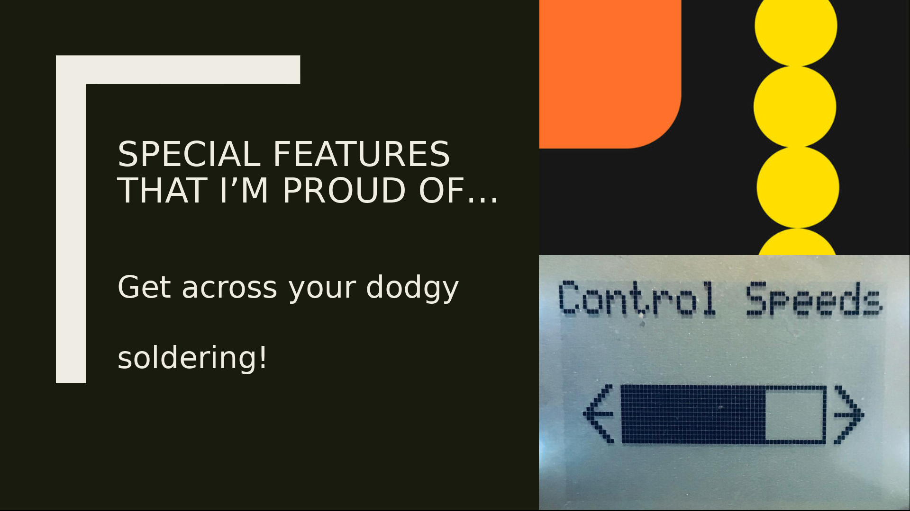

# SnakeVSBlock Game
Welcome to SnakeVSBlock, a game programmed using advanced C++ techniques and designed to run on a K64F board of ARM mbed. This game features multiple programmed modes such as motion control and joystick, and includes custom-made sprites, sound, and animations. The code has been optimized for efficient gameplay with purpose-driven architecture, using important coding practices such as Object-Oriented Programming, version control, debugging, and Doxygen for project documentation, all following a standard coding style.

In addition to these advanced C++ techniques, the game also employs iterative logic for choosing block numbers, adding an extra layer of complexity to the gameplay. The highest resolution at high speeds and smooth animations, with reaction times above your critical flicker fusion frequency, make for an immersive gaming experience. The game also provides the ability to control your gameplay with your preferred method, and stabilizes unwanted movement, helping to develop focus and precision.

Not only is this game fun to play, but it's also fully customizable using settings in the menu, with stats to help you keep track of your progress. Animations don't just visually aid the game, but are an integral part of the gameplay itself.

So if you're looking for a challenging and addictive game that pushes the limits of what C++ can do, look no further than SnakeVSBlock.

## How to Play
Move the joystick or tilt the gamepad in left/right directions to move the snake on the screen.

Avoid colliding with blocks - the number on the colliding block indicates the length that will be reduced at the end.

Colliding with food increases your length.

Barriers and sides of blocks cannot be crossed over.

Tips:
- Speed up by curving across edges of objects
- Slide away from the bottom of blocks to avoid collision

You lose if the snake’s length becomes 0! Form records and compete with friends. Random, but optimized sound generated at the end of each level. You can end the game any time using the BACK button. Game speeds named logically, to imply the nature required to play.

The game uses iterative logic for choosing block numbers, and is fully customizable using settings in the menu. Stats help you keep track of the game, and animations don’t just visually aid the game, they’re an integral part.

## Key Features
Highest resolution at high speeds.
No annoying glitches.
Smooth animations with reaction times above your critical flicker fusion frequency.
Control your game with your preferred method.
Unwanted movement stabilized, helping to develop focus and precision.
The snake ‘wiggles’ away your irritation.
Addictive and popular!
Form records and compete with friends.
Random, but optimized sound generated at the end of each level.
Stats help you keep track of the game.

## Technical Details
SnakeVSBlock was designed with a custom-made PCB using AutoCAD Eagle, soldered with required hardware such as LEDs, sensors, buttons, and an LCD screen, for efficient gameplay with purpose-driven architecture.

Important coding practices such as Object-Oriented Programming, version control, debugging, and Doxygen were used for project documentation, following a standard coding style.

Based on a game on Android by VOODOO, the game's main.cpp file is the entry point, calling all necessary functions in a sequential manner. The main.h file defines all the directives and objects to use along with the definition of its own function prototypes. The Snake-test.h and tests.h files are used to check the response of the snake to different kinds of inputs.

## Usage
To use SnakeVSBlock on the K64F board of ARM mbed, follow these steps:
- Clone the repository onto your local machine.
- Open the project in your preferred C++ IDE (such as Keil uVision).
- Set up the mbed environment for your IDE as per the instructions on the mbed website.
- Compile the code using your IDE's build tools.
- Transfer the compiled code to the K64F board.
- Connect the board to a power source and turn it on.
- Play the game using the joystick or gamepad controls.

Note: Some modifications may be required to compile and run the game on boards other than the K64F board of ARM mbed.